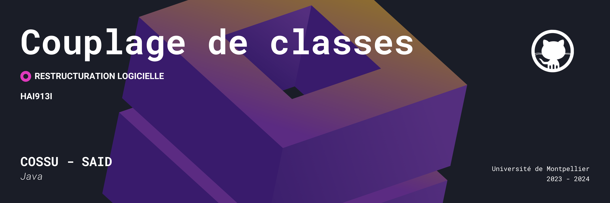

# HAI913I_TP2 TP2 de restructuration logicielle
Ce readme détaille le travail réalisé dans le cadre du TP2 de l’UE HAI913I. Il concerne la conception d'un outil d'analyse de programmes pour le couplage de classes Java en vue de déduire des clusters et des modules.

## Guide d'utilisation
### Étapes pour lancer et utiliser l'outil :
1. Ouvrez le projet source téléchargeable depuis notre GitHub avec votre IDE.
2. Si nécessaire, résolvez les problèmes de build path en ajoutant `commons-io-2.4.jar`, présent à la racine, au build path du projet.
3. Changez le projectPath, dans codeanalyzer/CodeAnalyzer.java (pour la version sans Spoon) et dans spoon/src/main/java/CodeAnalyzer.java (pour la version Spoon).
4. Lancez le fichier `Parser.java`.
5. Une fois le projet lancé, le résultat s'affichera dans le terminal.
7. Cliquez sur "Run".
8. Après quelques secondes, vous obtiendrez toutes les informations de votre projet (clusters, graphe d’appel, etc.).

---
**Note :** Assurez-vous d'avoir les autorisations et les prérequis nécessaires pour exécuter le code. Pour plus de détails, consultez le guide d'utilisation du projet.

